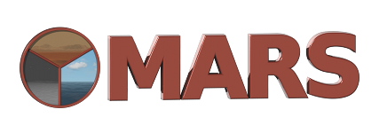

MARS (Machina Arte Robotum Simulans) is a cross-platform simulation and visualisation tool created for robotics research. It runs on (Ubuntu) Linux, Mac and Windows and consists of a core framework containing all main simulation components, a GUI (based on [Qt]()), 3D visualization (using [OSG](http://www.openscenegraph.org)) and a physics core (based on [ODE](http://www.ode.org)).  
MARS is designed in a modular manner and can be used very flexibly, e.g. by running the physics simulation without visualization and GUI.
It is possible to extend MARS writing your own plugins and many plugins introducing various functionality such as HUDs or custom ground reaction forces already exist - and it's easy to write your own.

## Installation

We don't yet provide binaries for MARS, thus installing it requires downloading the source and building it locally. To simplify this task, we have created a set of install scripts that will do all the work of downloading and installing dependencies, cloning the MARS repository and building for you. They have their own repository here on GitHub: [MARS install scripts](https://github.com/rock-simulation/mars_install_scripts)

## Documentation

You can find MARS' documentation on its [GitHub Page](http://rock-simulation.github.io/mars).

## License

MARS is distributed under the [Lesser GNU Public License (LGPL)](https://www.gnu.org/licenses/lgpl.html).
