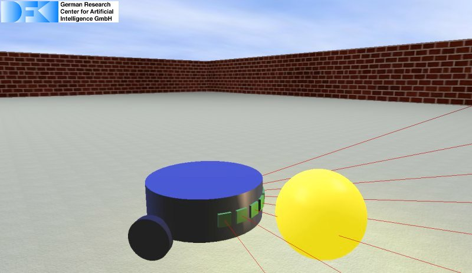

Basic Plugin {#tutorial_basic_plugin}
============

## Introduction

There are different possibilities how the MARS simulation can be
used. One possibility is to write a plugin that handles the loading of
a scenario and interfaces the simulation to some control software.
Also, in many cases, the control software can be directly wrapped into
a simulation plugin.  This tutorial will guide you how to create a new
plugin, load your scene, and control the simulation.

## Prerequisites

We assume you already have a MARS development environment setup in
"$MARS_DEV_ROOT".  You should also have a robot scene file to start
with (if not you can use this `scene <robo.scn>`_ to follow the
tutorial.  You should have a terminal opened with the
$MARS_DEV_ROOT/env.sh sourced into it.

    cd $MARS_DEV_ROOT;
    . env.sh

## Basic Plugin

### Create and build a new plugin

To setup your first plugin you can use a script wich will create a new
plugin:

    cd $MARS_DEV_ROOT/mars/plugins/plugin_template
    ./cnp.sh

The script will ask you for the project name, from which it will also
try to derive the class name of the main c++ class.  E.g. we can enter
"basic_plugin" here and the main class will then be called
"BasicPlugin".  Then you can enter a description of your plugin ("The
plugin created by following the guide of the basic plugin tutorial.").
Afterwards, enter the author name, email, and confirm your data.  The
script will create a folder containing your plugin one directory above
the script location ("$MARS_DEV_ROOT/mars/plugins/basic_plugin").  You
can go into that folder and use the build.sh script to build the
plugin for a first test if everything went well.  To install the
plugin you have to use "make install" within the newly created build
folder.

    cd $MARS_DEV_ROOT/mars/plugins/basic_plugin
    ./build.sh
    cd build
    make install

Now copy the "mars_default" configuration to "mars_basic_plugin" and
add the plugin to the "other_libs.txt" within "mars_basic_plugin" to
load the new plugin when starting MARS.

    cd $MARS_DEV_ROOT/install/configuration
    cp -r mars_default mars_basic_plugin
    cd mars_basic_plugin

Content of other_libs.txt:

    log_console
    connexion_plugin
    data_broker_gui
    cfg_manager_gui
    lib_manager_gui
    basic_plugin

Start the simulation:

    mars_app

Currently the plugin does not do anything, but it should show up in
the list of loaded plugins which you can find under the menu entry:
File->Library Info...

### Adapt the plugin

In the "$MARS_DEV_ROOT/mars/plugins/basic_plugin/src/BasicPlugin.cpp"
you will find a "init()" function that is called by the simulation to
initialize the plugin.  If your initialization code depends on the
simulation or other plugins you should rather perform it in the init()
function than in the constructor as the other modules may not be in a
defined state, yet.  Just comment in the loadScene line with the path to
your scene file.

~~~~~~~~~~~~~~~~~~~~~~~~~~~~~~~~~~~~~~~~~~~~~~~~~~~~~~~~~~~~{.cpp}
void BasicPlugin::init() {
    // Load a scene file:
    control->sim->loadScene("robo.scn");
~~~~~~~~~~~~~~~~~~~~~~~~~~~~~~~~~~~~~~~~~~~~~~~~~~~~~~~~~~~~

In this tutorial we are going to access the motors and sensors of the
simulation.  To do that we first need to include the corresponding
interfaces:

~~~~~~~~~~~~~~~~~~~~~~~~~~~~~~~~~~~~~~~~~~~~~~~~~~~~~~~~~~~~{.cpp}
#include <mars/interfaces/sim/MotorManagerInterface.h>
#include <mars/interfaces/sim/SensorManagerInterface.h>
~~~~~~~~~~~~~~~~~~~~~~~~~~~~~~~~~~~~~~~~~~~~~~~~~~~~~~~~~~~~

To control the robot in the simulation you can set motor values in the
update callback.  The update callback is triggered by the simulation
thread giving the simulation step time as parameter.  Here we can set
some motor values:

~~~~~~~~~~~~~~~~~~~~~~~~~~~~~~~~~~~~~~~~~~~~~~~~~~~~~~~~~~~~{.cpp}
void BasicPlugin::update(sReal time_ms) {

    control->motors->setMotorValue(1, 1.0);
    control->motors->setMotorValue(2, 3.0);
}
~~~~~~~~~~~~~~~~~~~~~~~~~~~~~~~~~~~~~~~~~~~~~~~~~~~~~~~~~~~~

After doing "make install" in
"$MARS_DEV_ROOT/mars/plugins/basic_plugin/build" we should have a
small robot driving in circles when we start the simulation.

In the next step we want to read the sensor values from the laser
scanner to create a wall following behavior.  We can access the sensor
values by the id the sensor gets when it is loaded into the
simulation:

~~~~~~~~~~~~~~~~~~~~~~~~~~~~~~~~~~~~~~~~~~~~~~~~~~~~~~~~~~~~{.cpp}
void BasicPlugin::update(sReal time_ms) {
    static unsigned long laserId = control->sensors->getSensorID("laser");

    control->motors->setMotorValue(1, 1.0);
    control->motors->setMotorValue(2, 3.0);
}
~~~~~~~~~~~~~~~~~~~~~~~~~~~~~~~~~~~~~~~~~~~~~~~~~~~~~~~~~~~~

The "getSensorData()" methods takes the sensor id and a pointer to a
unallocated sReal pointer as arguments.  It will allocate memory for
the sensor data but the caller (in this case that is you) is
responsible for freeing the memory after reading the sensor data.  The
method returns the number of values representing the sensor data.

~~~~~~~~~~~~~~~~~~~~~~~~~~~~~~~~~~~~~~~~~~~~~~~~~~~~~~~~~~~~{.cpp}
void BasicPlugin::update(sReal time_ms) {
    static unsigned long laserId = control->sensors->getSensorID("laser");
    sReal *sensorData;
    int numSensorValues = control->sensors->getSensorData(laserId, &sensorData);
    assert(numSensorValues == 8);
    if(sensorData[3] < 1.0 || sensorData[0] < 0.4) {
      control->motors->setMotorValue(2, 12.0);
    } else if(sensorData[0] > 0.7) {
      control->motors->setMotorValue(2, 4.8);
    } else {
      control->motors->setMotorValue(2, 5.0);
    }
    control->motors->setMotorValue(1, 5.0);
    free(sensorData);
}
~~~~~~~~~~~~~~~~~~~~~~~~~~~~~~~~~~~~~~~~~~~~~~~~~~~~~~~~~~~~

Now we can do "make install" again, start the simulation, and we
should see the robot following the wall!

The plugin source generated by the "cnp.sh" script includes many
commented code, that gives examples of how to use the simulation
modules like the "DataBroker", the "CFGManager", or the "MainGUI".  A
seperated documentation of these modules will be created soon.

